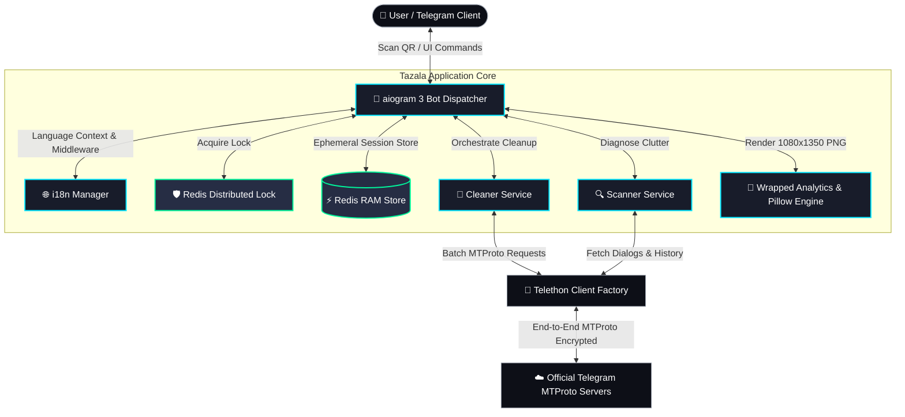

# 🧘 Tazala (Тазала)

<p align="center">
  <strong>Open-Source Telegram Info-Detox & Smart Organizer</strong><br>
  <em>Achieve complete digital Zen: clear 100k+ unread messages, auto-sort into smart folders, generate Spotify-style Wrapped cards, and destroy sessions with zero footprint.</em>
</p>

<p align="center">
  <a href="https://github.com/DeadOutside1/tazala/actions/workflows/ci.yml">
    
  </a>
  
  
  
  
  <a href="LICENSE">
    
  </a>
  
</p>

---

## ⚡ The Problem & The Tazala Solution

### 🔴 The Pain
> *"That persistent red Telegram badge with 100,000+ unread messages isn't productivity — it's chronic digital anxiety and cognitive clutter."*

Channels accumulate for years, group chats turn into graveyard spam, and searching for real conversations becomes overwhelming.

### 🟢 The Tazala Zen Workflow
1. **Scan a single QR code** via your official Telegram mobile app.
2. **Instant Account Diagnostics:** Discover inactive zombie channels, total unreads, and top noise sources.
3. **One-Click Zen Button:** Reset 100k+ unreads in seconds with safe FloodWait rate limiting.
4. **Smart Folder Auto-Sorting:** Auto-categorize dialogs into Work, News, Personal, and Dead chats ($\le 12$ characters, localized).
5. **Spotify-style Wrapped Card:** Get a stunning 1080x1350 PNG report for Telegram Stories with your hours saved, Zen Score, and unique Archetype.
6. **Zero-Knowledge Logout:** The ephemeral MTProto session is instantly destroyed on Telegram servers (`log_out()`) and wiped from Redis RAM.

<details>
<summary><strong>🇷🇺 Краткое описание на русском</strong></summary>

**Tazala** — открытый инструмент для инфо-детокса в Telegram:
- Вход по QR-коду без передачи паролей или номеров телефонов.
- Мгновенный сброс 100,000+ непрочитанных за секунды с защитой от блокировок.
- Сортировка по смарт-папкам («💼 Работа», «📰 Новости», «💬 Личные», «🗑 Мёртвые»).
- Вирусная Wrapped-карточка в стиле Spotify для Stories с расчетом сэкономленного времени и определением архетипа («Цифровой монах», «Цифровой плюшкин» и др.).
- Сессия уничтожается сразу после завершения работы (`client.log_out()`).
</details>

<details>
<summary><strong>🇰🇿 Қазақша қысқаша шолу</strong></summary>

**Tazala** — Telegram-дағы ақпараттық шуды тазартуға арналған Open-Source құрал:
- Телефон нөмірінсіз QR-код арқылы қауіпсіз кіру.
- 100k+ оқылмаған хабарламаны бір сәтте белгілеу және тазарту.
- Смарт-папкаларға автоматты түрде топтастыру («💼 Жұмыс», «📰 Жаңалық», «💬 Жеке», «🗑 Өлі чаттар»).
- Stories-ке арналған Spotify үлгісіндегі Wrapped-карточка және Zen Score.
- Тазарту аяқталған соң сессия Telegram серверлерінен бірден жойылады (`log_out()`).
</details>

---

## ✨ Key Features

| Feature | Description |
| ------- | ----------- |
| 🔑 **Zero-Knowledge MTProto QR Login** | No phone numbers, no SMS codes. Connects directly via Telegram's native QR device linking. |
| 🧠 **In-Memory Ephemeral Sessions** | Session keys exist **strictly in Redis RAM** with a 300-second TTL. Zero bytes written to disk. |
| 🧹 **Flood-Safe Batch Cleanup** | Intelligent exponential backoff ensures 100,000+ messages are marked read without triggering Telegram FloodWait limits. |
| 📁 **Localized Smart Folders** | Strict compliance with Telegram's **$\le 12$ characters** folder title limit for all languages: Kazakh, Russian, and English. |
| 🎁 **1080x1350 Wrapped Stories Card** | High-resolution vertical graphic rendered with Pillow, featuring your Zen Score, hours saved, and behavioral Archetype. |
| 🌐 **Native Trilingual Support** | Full 100% translation parity across 🇰🇿 **Қазақша**, 🇷🇺 **Русский**, and 🇬🇧 **English**. |
| 🛡️ **Distributed Redis Locks** | Concurrency control via `RedisLock` prevents accidental duplicate clicks during heavy tasks. |
| 🔒 **Permanent Revocation** | Calling `client.log_out()` immediately invalidates authorization keys on Telegram data centers. |

---

## 🏗️ System Architecture



---

## 🚀 Quickstart

### Option A: Running with Docker Compose (Recommended)

1. **Clone the repository:**
   ```bash
   git clone https://github.com/DeadOutside1/tazala.git
   cd tazala
   ```

2. **Configure environment:**
   ```bash
   cp .env.example .env
   ```
   Edit `.env` with your credentials:
   - `TELEGRAM_API_ID` & `TELEGRAM_API_HASH` from [my.telegram.org](https://my.telegram.org)
   - `TELEGRAM_BOT_TOKEN` from [@BotFather](https://t.me/BotFather)

3. **Start the containers:**
   ```bash
   docker compose up --build -d
   ```

4. **Verify running services:**
   ```bash
   docker compose ps
   docker compose logs -f backend
   ```

---

### Option B: Local Development Setup

1. **Prerequisites:** Python 3.12+ and Redis 7+.
2. **Install dependencies:**
   ```bash
   cd backend
   pip install -e ".[dev]"
   ```
3. **Run the test suite:**
   ```bash
   pytest -v
   ```
4. **Run code linter:**
   ```bash
   ruff check app tests scripts
   ```
5. **Start the FastAPI + aiogram dev server:**
   ```bash
   uvicorn app.main:app --host 0.0.0.0 --port 8000 --reload
   ```

---

## 🛠️ CLI Debug Utilities

For development and headless terminal debugging without opening Telegram:

```bash
# Interactive QR-code login directly in your terminal (prints ASCII QR & direct link)
python -m scripts.cli_qr

# Diagnostic scan of active session with tabular clutter breakdown
python -m scripts.cli_scan [<session_id>]
```

---

## 🤖 Bot Commands

| Command | Description |
| ------- | ----------- |
| `/start` | Launch the welcome onboarding and QR code authentication flow. |
| `/help` | Display details about Zero-Knowledge architecture and security principles. |
| `/lang` | Change interface language: 🇰🇿 Қазақша, 🇷🇺 Русский, or 🇬🇧 English. |

---

## 🛡️ Security Manifesto

For full details on our cryptographic isolation, ephemeral RAM storage, and vulnerability disclosure policy, please see our dedicated [SECURITY.md](SECURITY.md).

> **TL;DR:** We never store your passwords, phone numbers, or session strings on persistent disks. Sessions expire in 300 seconds, and keys are permanently revoked via `log_out()`.

---

## 🤝 Contributing

Contributions are welcome! Whether it's adding presets, improving translation accuracy, or optimizing MTProto batching:

1. Fork the Project.
2. Create your Feature Branch (`git checkout -b feat/amazing-feature`).
3. Ensure all tests pass (`pytest -v`) and linter is clean (`ruff check app tests scripts`).
4. Commit your Changes (`git commit -m 'feat: add amazing feature'`).
5. Push to the Branch (`git push origin feat/amazing-feature`).
6. Open a Pull Request.

---

## 📄 License

Distributed under the **MIT License**. See [LICENSE](LICENSE) for more information.
