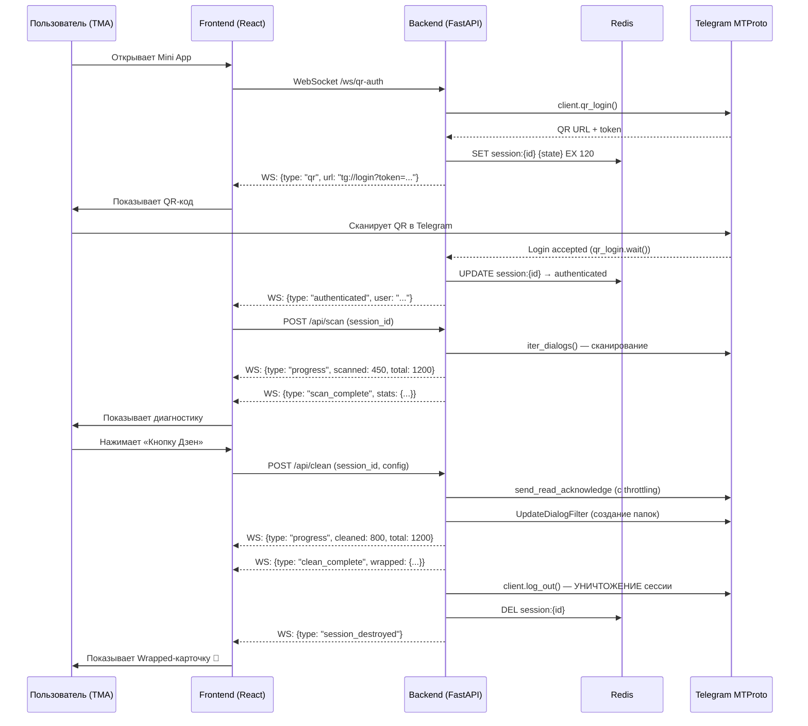

# TG Zen: Info-Detox & Smart Organizer — Implementation Plan

> **Цель:** MVP за 3 недели. Telegram Mini App для «инфо-детокса» — сброс 100k+ непрочитанных, авто-папки, вирусная Wrapped-карточка.

---

## Блок 1. Архитектура (Agent-Friendly Architecture)

### 1.1 Выбор стека: Python FastAPI + Telethon ✅

| Критерий | Python FastAPI + Telethon | TypeScript Fastify + GramJS |
|---|---|---|
| **MTProto зрелость** | Telethon — самая зрелая, документированная библиотека MTProto. `qr_login()` работает «из коробки» | GramJS менее документирован, QR-login требует ручной работы с `ExportLoginToken` |
| **Скорость разработки для агента** | Python — основной язык агентов Antigravity, контекст не теряется | Переключение контекста между TS backend и Python MTProto |
| **Async-ready** | FastAPI + asyncio нативно, Telethon — full async | Хорошо, но Telethon выигрывает по экосистеме |
| **Тестируемость** | pytest-asyncio, httpx.AsyncClient — стандарт | Жизнеспособно, но менее привычно для агента |
| **Community & Stack Overflow** | Огромная база ответов по Telethon | Значительно меньше |

**Решение:** `Python 3.12 + FastAPI + Telethon + Redis + Vite React (TMA Frontend)`

### 1.2 Структура монорепозитория

```
tg-zen/
├── docker-compose.yml          # Redis + Backend + Frontend
├── .env.example                # Шаблон переменных окружения
├── README.md
│
├── backend/                    # Python FastAPI сервер
│   ├── pyproject.toml          # uv/pip зависимости
│   ├── Dockerfile
│   ├── app/
│   │   ├── __init__.py
│   │   ├── main.py             # FastAPI app factory, CORS, lifespan
│   │   ├── config.py           # pydantic-settings (env vars)
│   │   ├── dependencies.py     # DI: Redis, etc.
│   │   │
│   │   ├── auth/               # Модуль авторизации (QR Login)
│   │   │   ├── __init__.py
│   │   │   ├── router.py       # WebSocket /ws/qr-auth
│   │   │   ├── service.py      # QR-генерация, ожидание, 2FA
│   │   │   └── schemas.py      # Pydantic модели сообщений WS
│   │   │
│   │   ├── scanner/            # Модуль сканирования диалогов
│   │   │   ├── __init__.py
│   │   │   ├── router.py       # POST /api/scan — запуск сканирования
│   │   │   ├── service.py      # iter_dialogs, анализ, статистика
│   │   │   └── schemas.py      # ScanResult, DialogStats
│   │   │
│   │   ├── cleaner/            # Модуль очистки (Кнопка Дзен)
│   │   │   ├── __init__.py
│   │   │   ├── router.py       # POST /api/clean — запуск очистки
│   │   │   ├── service.py      # mark_read, create_folders, throttling
│   │   │   └── schemas.py      # CleanConfig, CleanProgress
│   │   │
│   │   ├── wrapped/            # Модуль генерации Wrapped-карточки
│   │   │   ├── __init__.py
│   │   │   ├── router.py       # GET /api/wrapped/{session_id}
│   │   │   ├── service.py      # Генерация статистики + изображения
│   │   │   └── schemas.py      # WrappedStats
│   │   │
│   │   ├── telegram/           # Общий MTProto-слой (shared)
│   │   │   ├── __init__.py
│   │   │   ├── client_manager.py  # Пул/фабрика TelegramClient
│   │   │   ├── session_store.py   # Redis-based session storage
│   │   │   └── throttle.py        # FloodWait-aware rate limiter
│   │   │
│   │   └── tma/                # Валидация Telegram Mini App initData
│   │       ├── __init__.py
│   │       └── validator.py    # HMAC-SHA256 проверка initData
│   │
│   └── tests/
│       ├── conftest.py
│       ├── test_auth.py
│       ├── test_scanner.py
│       ├── test_cleaner.py
│       └── test_wrapped.py
│
├── frontend/                   # Vite + React + TypeScript (TMA)
│   ├── package.json
│   ├── Dockerfile
│   ├── vite.config.ts
│   ├── index.html
│   ├── src/
│   │   ├── main.tsx
│   │   ├── App.tsx
│   │   ├── hooks/
│   │   │   ├── useTelegram.ts      # WebApp SDK хук
│   │   │   └── useWebSocket.ts     # WS для QR-auth и progress
│   │   ├── pages/
│   │   │   ├── ScanPage.tsx        # QR-авторизация
│   │   │   ├── DiagnosticsPage.tsx # Результат сканирования
│   │   │   ├── CleaningPage.tsx    # Прогресс очистки
│   │   │   └── WrappedPage.tsx     # Wrapped-карточка
│   │   ├── components/
│   │   │   ├── QRCode.tsx
│   │   │   ├── StatsCard.tsx
│   │   │   ├── ProgressRing.tsx
│   │   │   └── WrappedCard.tsx
│   │   └── styles/
│   │       └── index.css           # Vanilla CSS design system
│   └── public/
│       └── tonconnect-manifest.json  # Если понадобится TON
│
└── scripts/                    # CLI-утилиты для dev/debug
    ├── test_qr_login.py        # Standalone QR-тест (без сервера)
    └── test_scan.py            # Standalone сканирование
```

> [!IMPORTANT]
> **Почему такая структура идеальна для AI-агентов:**
> - Каждый модуль (`auth/`, `scanner/`, `cleaner/`, `wrapped/`) — **атомарная единица работы** с собственными `router.py`, `service.py`, `schemas.py`
> - Агент может разрабатывать и тестировать каждый модуль изолированно через `pytest tests/test_auth.py`
> - Общий MTProto-слой в `telegram/` — единственная зависимость, которую все модули шарят
> - Контрактное тестирование: схемы Pydantic гарантируют совместимость между модулями

### 1.3 Архитектура сессий и QR-авторизации



**Ключевые решения по сессиям:**

| Аспект | Решение |
|---|---|
| **Хранение сессии Telethon** | `StringSession` в Redis с TTL 5 минут. НЕ записывается на диск |
| **WebSocket** | Один WS-канал на весь flow: auth → scan → clean → wrapped |
| **QR Token Refresh** | `qr_login.recreate()` каждые 25 секунд (токен живёт ~30 сек) |
| **2FA обработка** | При `SessionPasswordNeededError` — отправляем WS-сообщение клиенту для ввода пароля |
| **Безопасность** | `session_id` = UUID4, привязан к WebSocket connection. Нет cookies, нет JWT |
| **Уничтожение** | `client.log_out()` + `DEL Redis key` сразу после генерации Wrapped |

---

## Блок 2. Декомпозиция на спринты

### Неделя 1: Core MTProto Engine (5 дней)

| День | Задача | Выход | Верификация |
|---|---|---|---|
| **Д1** | Инициализация проекта: монорепо, pyproject.toml, Dockerfile, docker-compose (Redis), config.py | Проект запускается, Redis пингуется | `docker compose up && curl localhost:8000/health` |
| **Д2** | Модуль `auth/`: WebSocket QR-login endpoint, генерация QR, ожидание скана, обработка 2FA | QR-код генерируется, сессия авторизуется | `pytest tests/test_auth.py` + ручной тест через `wscat` |
| **Д3** | Модуль `telegram/`: client_manager (фабрика клиентов), session_store (Redis StringSession), throttle.py | Telethon клиенты создаются/уничтожаются корректно | `pytest tests/test_telegram.py` |
| **Д4** | Модуль `scanner/`: iter_dialogs, подсчёт статистики (total, unread, dead, by_type), фильтрация по дате | JSON со статистикой 1200 диалогов | `pytest tests/test_scanner.py` + standalone скрипт |
| **Д5** | Модуль `cleaner/`: batch mark_read с throttling, создание DialogFilter папок (≤12 символов), logout | Непрочитанные сброшены, папки созданы, сессия убита | `pytest tests/test_cleaner.py` + ручная проверка в Telegram |

### Неделя 2: Telegram Mini App Frontend (5 дней)

| День | Задача | Выход | Верификация |
|---|---|---|---|
| **Д6** | Инициализация Vite + React + TS, подключение Telegram WebApp SDK, тема, роутинг | Пустое TMA открывается в BotFather | Открыть через `@BotFather` → `/newapp` |
| **Д7** | ScanPage: QR-код (WebSocket → qrcode.react), анимация ожидания, обработка 2FA промпта | Пользователь видит QR, сканирует, авторизуется | E2E тест в TMA |
| **Д8** | DiagnosticsPage: карточки статистики, визуализация (круговая диаграмма типов чатов, шкала «мусора»), кнопка «Дзен» | Красивый экран диагностики с данными с бэка | Скриншот-тест |
| **Д9** | CleaningPage: анимированный прогресс-бар очистки, лог действий (сброс → папки → logout) | Прогресс в реальном времени через WS | Manual E2E |
| **Д10** | WrappedPage: Wrapped-карточка (Spotify Wrapped стиль), кнопка «Поделиться в Stories» (`Telegram.WebApp.shareToStory()`) | Генерируется PNG-карточка, шарится в Stories | Manual test |

### Неделя 3: Production Hardening & Launch (5 дней)

| День | Задача | Выход | Верификация |
|---|---|---|---|
| **Д11** | Background задачи: вынос scan/clean в очереди (asyncio.TaskGroup или arq/dramatiq), прогресс через Redis Pub/Sub | Очистка не блокирует WebSocket event loop | Load test с 5 параллельными сессиями |
| **Д12** | FloodWait Protection: экспоненциальный backoff, retry-логика, per-account rate limiter, graceful degradation | Нет FloodWaitError при 1000+ mark_read | Stress test |
| **Д13** | Контейнеризация: multi-stage Docker, nginx reverse proxy, SSL (Let's Encrypt), health checks | `docker compose up` на VPS = всё работает | `curl -k https://tg-zen.example.com/health` |
| **Д14** | Деплой на VPS (Hetzner/DigitalOcean), настройка домена, BotFather конфигурация TMA URL | Продакшн доступен через Mini App | Полный E2E через Telegram |
| **Д15** | Open-Source упаковка: README с GIF-демо, SECURITY.md, LICENSE (MIT), GitHub Actions CI | Репозиторий готов к публикации | `gh repo view` + CI green |

### 3 промпта-задания для агента Antigravity (Неделя 1)

#### Промпт 1: Инициализация проекта + QR Auth Engine

```
Создай Python проект в директории `backend/` со следующей структурой:

1. `pyproject.toml` с зависимостями: fastapi, uvicorn[standard], telethon, redis[hiredis], 
   pydantic-settings, python-dotenv, qrcode[pil], websockets
2. `app/config.py` — Pydantic BaseSettings: TELEGRAM_API_ID, TELEGRAM_API_HASH, 
   REDIS_URL (default: redis://localhost:6379), HOST, PORT
3. `app/main.py` — FastAPI app с lifespan (инициализация Redis), CORS middleware, 
   health endpoint GET /health
4. `app/auth/router.py` — WebSocket endpoint `/ws/qr-auth`:
   - При подключении: создать TelegramClient с StringSession(""), подключить
   - Вызвать client.qr_login(), отправить QR URL клиенту
   - Каждые 25 сек: qr_login.recreate() и отправлять новый URL
   - При успешном скане: отправить {type: "authenticated"} 
   - При SessionPasswordNeededError: отправить {type: "2fa_required"} и ждать пароль
   - Сохранить StringSession в Redis с TTL 300 секунд
5. `app/auth/schemas.py` — Pydantic модели: QRMessage, AuthResult, TwoFARequest
6. `.env.example` с переменными
7. `Dockerfile` (python:3.12-slim, uv для установки)
8. `docker-compose.yml` с сервисами: redis, backend

Обязательно:
- Все функции async
- Logging через structlog или стандартный logging
- Type hints везде
- Обработка ошибок WebSocket disconnect
- Тест `tests/test_auth.py` с мокированным Telethon клиентом
```

#### Промпт 2: Scanner — Диагностика Telegram аккаунта

```
В проекте `backend/app/` создай модуль `scanner/` для анализа Telegram аккаунта:

1. `scanner/service.py`:
   - Функция `scan_account(client: TelegramClient) -> ScanResult`:
     - Получить ВСЕ диалоги через `client.iter_dialogs()`
     - Для каждого диалога собрать: id, name, type (user/group/channel/bot), 
       unread_count, last_message_date, is_archived, folder_id
     - Классифицировать диалоги:
       * "dead" — последнее сообщение старше 6 месяцев
       * "zombie" — канал/группа без сообщений за 12 месяцев
       * "active" — есть сообщения за последний месяц
       * "moderate" — остальные
     - Подсчитать статистику: total_dialogs, total_unread, dead_count, 
       zombie_count, channels_count, groups_count, users_count, bots_count
     - Отправлять прогресс через callback каждые 50 диалогов

2. `scanner/schemas.py`:
   - ScanResult: total_dialogs, total_unread, dead_percentage, categories dict, 
     top_unread_chats (top 10), scan_duration_seconds
   - DialogInfo: id, name, type, unread_count, last_activity, status

3. `scanner/router.py`:
   - POST /api/scan — принимает session_id, загружает StringSession из Redis, 
     подключает клиент, запускает scan_account, возвращает ScanResult
   - Прогресс отправляется через WebSocket (если есть активное соединение)

4. `tests/test_scanner.py`:
   - Тест с мокированными диалогами (создай фикстуры с 50 диалогами разных типов)
   - Проверка корректности классификации и подсчёта статистики

Важно:
- Обработка пустых/удалённых чатов (try/except для каждого диалога)
- Performance: используй `iter_dialogs()`, не `get_dialogs()`
- Все даты в UTC
```

#### Промпт 3: Cleaner — Кнопка Дзен (Mark Read + Auto-Folders)

```
В проекте `backend/app/` создай модуль `cleaner/` — ядро «Кнопки Дзен»:

1. `cleaner/service.py`:
   - Функция `mark_all_as_read(client, dialogs, progress_callback)`:
     - Batch mark_read с throttling: пауза 1.5 сек между каждым диалогом
     - Обработка FloodWaitError: await asyncio.sleep(error.seconds + 5)
     - Прогресс через callback: {action: "mark_read", done: N, total: M}
   
   - Функция `create_smart_folders(client, dialogs, is_premium)`:
     - Определить существующие папки через GetDialogFiltersRequest
     - НЕ трогать существующие папки пользователя!
     - Создать новые папки (если не существуют):
       * "💼 Работа" (≤12 символов!) — группы/каналы с ключевыми словами work/job/hr/dev/code
       * "📰 Новости" (≤12 символов!) — каналы news/media/digest
       * "💬 Личные" (≤12 символов!) — приватные чаты (is_user=True)
       * "🗑 Мёртвые" (≤12 символов!) — dead/zombie диалоги
     - Лимит чатов на папку: 100 (Free) / 200 (Premium)
     - Использовать UpdateDialogFilterRequest
     - Throttling: пауза 2 сек между созданием папок
   
   - Функция `execute_zen_cleanup(client, scan_result, config) -> CleanResult`:
     - Оркестрация: mark_all_as_read → create_smart_folders → generate_wrapped_stats
     - По завершении: client.log_out() — ОБЯЗАТЕЛЬНО

2. `cleaner/schemas.py`:
   - CleanConfig: mark_read (bool), create_folders (bool), folder_names (optional override)
   - CleanResult: messages_marked, folders_created, duration, wrapped_stats
   - CleanProgress: step (mark_read|folders|logout), done, total, current_chat

3. `app/telegram/throttle.py`:
   - Класс `FloodSafeExecutor`:
     - Выполняет async callable с автоматическим retry при FloodWaitError
     - Экспоненциальный backoff: base_delay=1.5s, max_delay=60s
     - Максимум 3 retry
     - Logging каждого FloodWait

4. `cleaner/router.py`:
   - POST /api/clean — принимает session_id + CleanConfig
   - Запускает execute_zen_cleanup как background task
   - Прогресс через WebSocket

5. `tests/test_cleaner.py`:
   - Тест mark_all_as_read с мокированным FloodWaitError
   - Тест create_smart_folders: проверка длины названий (≤12 символов)
   - Тест throttle: проверка задержек

КРИТИЧНО:
- Названия папок СТРОГО ≤ 12 символов (включая эмодзи = 1 символ в Telegram API)
- ВСЕГДА client.log_out() в finally блоке
- НИКОГДА не удалять существующие папки пользователя
```

---

## Блок 3. Эталонная реализация ядра авторизации

### 3.1 QR Auth Service — Telethon + FastAPI WebSocket

```python
# backend/app/auth/service.py
"""
QR Login Service — ядро авторизации через MTProto QR-код.
Zero-Knowledge: сессия живёт только в RAM (Redis TTL 5 мин), 
физически уничтожается после очистки.
"""
import asyncio
import logging
from dataclasses import dataclass
from enum import Enum
from telethon import TelegramClient
from telethon.sessions import StringSession
from telethon.errors import SessionPasswordNeededError

logger = logging.getLogger(__name__)


class AuthState(str, Enum):
    QR_GENERATED = "qr_generated"
    WAITING_SCAN = "waiting_scan"
    TWO_FA_REQUIRED = "2fa_required"
    AUTHENTICATED = "authenticated"
    FAILED = "failed"


@dataclass
class QRLoginResult:
    state: AuthState
    qr_url: str | None = None
    session_string: str | None = None
    user_id: int | None = None
    username: str | None = None
    error: str | None = None


class QRAuthService:
    """Управляет жизненным циклом QR-авторизации."""

    def __init__(self, api_id: int, api_hash: str):
        self.api_id = api_id
        self.api_hash = api_hash

    async def create_client(self) -> TelegramClient:
        """Создаёт новый Telethon клиент с пустой StringSession."""
        client = TelegramClient(
            StringSession(""),  # Пустая — ничего на диске
            self.api_id,
            self.api_hash,
            device_model="TG Zen WebApp",
            system_version="1.0",
            app_version="1.0.0",
        )
        client.flood_sleep_threshold = 60  # Авто-сон до 60 сек
        await client.connect()
        return client

    async def start_qr_login(
        self,
        client: TelegramClient,
        on_qr_url: callable,  # async callback(url: str)
        on_state_change: callable,  # async callback(state: AuthState)
        timeout: int = 120,
    ) -> QRLoginResult:
        """
        Полный цикл QR-авторизации с авто-обновлением токена.
        
        Args:
            client: Подключённый TelegramClient
            on_qr_url: Колбэк для отправки нового QR URL клиенту
            on_state_change: Колбэк для уведомления о смене состояния
            timeout: Максимальное время ожидания (секунды)
        """
        try:
            qr_login = await client.qr_login()
            await on_qr_url(qr_login.url)
            await on_state_change(AuthState.QR_GENERATED)

            # Авто-обновление QR каждые 25 секунд (токен живёт ~30 сек)
            max_attempts = timeout // 25
            for attempt in range(max_attempts):
                try:
                    await asyncio.wait_for(
                        qr_login.wait(), timeout=25
                    )
                    # Успешная авторизация!
                    break
                except asyncio.TimeoutError:
                    # Токен истёк — регенерируем
                    logger.info(f"QR token expired, recreating (attempt {attempt + 1})")
                    await qr_login.recreate()
                    await on_qr_url(qr_login.url)
            else:
                return QRLoginResult(
                    state=AuthState.FAILED,
                    error="QR login timed out after {timeout}s"
                )

            # Авторизация прошла успешно
            me = await client.get_me()
            session_string = client.session.save()

            await on_state_change(AuthState.AUTHENTICATED)
            return QRLoginResult(
                state=AuthState.AUTHENTICATED,
                session_string=session_string,
                user_id=me.id,
                username=me.username,
            )

        except SessionPasswordNeededError:
            # Аккаунт с 2FA — нужен пароль
            await on_state_change(AuthState.TWO_FA_REQUIRED)
            return QRLoginResult(state=AuthState.TWO_FA_REQUIRED)

        except Exception as e:
            logger.exception("QR login failed")
            return QRLoginResult(
                state=AuthState.FAILED,
                error=str(e)
            )

    async def complete_2fa(
        self, client: TelegramClient, password: str
    ) -> QRLoginResult:
        """Завершает авторизацию с 2FA-паролем."""
        try:
            await client.sign_in(password=password)
            me = await client.get_me()
            session_string = client.session.save()
            return QRLoginResult(
                state=AuthState.AUTHENTICATED,
                session_string=session_string,
                user_id=me.id,
                username=me.username,
            )
        except Exception as e:
            return QRLoginResult(
                state=AuthState.FAILED,
                error=f"2FA failed: {e}"
            )

    @staticmethod
    async def destroy_session(client: TelegramClient):
        """ФИЗИЧЕСКОЕ уничтожение сессии — Zero-Knowledge."""
        try:
            await client.log_out()
            logger.info("Session destroyed via log_out()")
        except Exception as e:
            logger.warning(f"log_out() failed (may already be disconnected): {e}")
        finally:
            await client.disconnect()
```

### 3.2 WebSocket Router — Real-time QR Flow

```python
# backend/app/auth/router.py
"""
WebSocket endpoint для QR-авторизации.
Один WebSocket = весь flow: QR → auth → scan → clean → wrapped.
"""
import json
import uuid
import logging
from fastapi import APIRouter, WebSocket, WebSocketDisconnect
from redis.asyncio import Redis

from app.config import settings
from app.auth.service import QRAuthService, AuthState

logger = logging.getLogger(__name__)
router = APIRouter()


@router.websocket("/ws/qr-auth")
async def qr_auth_websocket(websocket: WebSocket):
    await websocket.accept()
    session_id = str(uuid.uuid4())
    logger.info(f"New QR auth session: {session_id}")

    auth_service = QRAuthService(
        api_id=settings.TELEGRAM_API_ID,
        api_hash=settings.TELEGRAM_API_HASH,
    )
    client = None

    try:
        # 1. Создаём MTProto клиент
        client = await auth_service.create_client()

        # Колбэки для real-time обновлений
        async def on_qr_url(url: str):
            await websocket.send_json({
                "type": "qr",
                "session_id": session_id,
                "url": url,  # tg://login?token=...
            })

        async def on_state_change(state: AuthState):
            await websocket.send_json({
                "type": "state",
                "state": state.value,
            })

        # 2. Запускаем QR-авторизацию
        result = await auth_service.start_qr_login(
            client=client,
            on_qr_url=on_qr_url,
            on_state_change=on_state_change,
            timeout=120,
        )

        # 3. Обработка 2FA
        if result.state == AuthState.TWO_FA_REQUIRED:
            await websocket.send_json({"type": "2fa_required"})
            # Ждём пароль от клиента
            data = await websocket.receive_json()
            if data.get("type") == "2fa_password":
                result = await auth_service.complete_2fa(
                    client, data["password"]
                )

        # 4. Сохраняем сессию в Redis (TTL 5 минут)
        if result.state == AuthState.AUTHENTICATED:
            redis: Redis = websocket.app.state.redis
            await redis.setex(
                f"session:{session_id}",
                300,  # TTL 5 минут
                result.session_string,
            )
            await websocket.send_json({
                "type": "authenticated",
                "session_id": session_id,
                "user_id": result.user_id,
                "username": result.username,
            })
            # Клиент НЕ отключается — WebSocket остаётся для scan/clean
        else:
            await websocket.send_json({
                "type": "error",
                "error": result.error or "Authentication failed",
            })

    except WebSocketDisconnect:
        logger.info(f"Client disconnected: {session_id}")
    except Exception as e:
        logger.exception(f"QR auth error: {e}")
        try:
            await websocket.send_json({"type": "error", "error": str(e)})
        except Exception:
            pass
    finally:
        # ВСЕГДА уничтожаем сессию при дисконнекте (если не authenticated)
        if client and not client.is_connected():
            pass  # Уже отключён
        elif client:
            # Если пользователь отвалился до завершения — убиваем сессию
            await auth_service.destroy_session(client)
```

### 3.3 Session Store — Redis с автоуничтожением

```python
# backend/app/telegram/session_store.py
"""
Redis-based ephemeral session storage.
Сессии живут ТОЛЬКО в оперативной памяти Redis, НЕ на диске.
TTL = 5 минут. После использования — физическое удаление + log_out().
"""
import logging
from redis.asyncio import Redis
from telethon import TelegramClient
from telethon.sessions import StringSession

from app.config import settings

logger = logging.getLogger(__name__)


class SessionStore:
    def __init__(self, redis: Redis):
        self.redis = redis
        self.default_ttl = 300  # 5 минут

    async def save(self, session_id: str, session_string: str, ttl: int = None):
        """Сохраняет StringSession в Redis с TTL."""
        await self.redis.setex(
            f"session:{session_id}",
            ttl or self.default_ttl,
            session_string,
        )
        logger.info(f"Session {session_id[:8]}... saved (TTL {ttl or self.default_ttl}s)")

    async def load(self, session_id: str) -> TelegramClient | None:
        """Загружает сессию из Redis и возвращает подключённый клиент."""
        session_string = await self.redis.get(f"session:{session_id}")
        if not session_string:
            logger.warning(f"Session {session_id[:8]}... not found or expired")
            return None

        client = TelegramClient(
            StringSession(session_string.decode()),
            settings.TELEGRAM_API_ID,
            settings.TELEGRAM_API_HASH,
        )
        await client.connect()

        if not await client.is_user_authorized():
            logger.warning(f"Session {session_id[:8]}... is no longer authorized")
            await self.destroy(session_id, client)
            return None

        return client

    async def destroy(self, session_id: str, client: TelegramClient = None):
        """ПОЛНОЕ уничтожение: Redis DEL + Telegram log_out()."""
        # 1. Удаляем из Redis
        await self.redis.delete(f"session:{session_id}")

        # 2. Logout из Telegram (инвалидирует auth key на серверах TG)
        if client:
            try:
                await client.log_out()
                logger.info(f"Session {session_id[:8]}... destroyed (log_out + Redis DEL)")
            except Exception as e:
                logger.warning(f"log_out() failed: {e}")
            finally:
                await client.disconnect()

    async def extend_ttl(self, session_id: str, extra_seconds: int = 120):
        """Продлевает TTL (например, во время долгой очистки)."""
        await self.redis.expire(f"session:{session_id}", extra_seconds)
```

---

## Блок 4. Продуктовый взлёт и упаковка

### 4.1 Вирусный пост (Хабр / VC.ru / Пикабу)

**Заголовок (A/B варианты):**
- 🔥 «Я написал сервис, который обнуляет 136 000 непрочитанных в Telegram за 5 секунд — и почему я уничтожаю вашу сессию»
- 🧹 «Инфо-детокс Telegram: Open-Source Mini App для очистки цифрового хлама. Технический разбор MTProto + Zero-Knowledge»

**Структура поста:**

```
1. ХУКОВОЕ ВСТУПЛЕНИЕ (проблема + эмоция)
   "У меня 1048 диалогов и 136 000 непрочитанных. Красный бейдж на иконке 
   Telegram вызывает физическую тревожность. Знакомо?"
   [Скриншот бейджа 136k]

2. ЧТО Я СДЕЛАЛ (демо — GIF или Loom, 15 сек)
   "Один QR-код → 5 секунд → бейдж обнулён, чаты рассортированы, мёртвые 
   каналы в папке 🗑. И вот моя Wrapped-карточка:"
   [Вставить Wrapped-карточку]

3. ПОЧЕМУ ЭТО БЕЗОПАСНО (технический блок — для Хабра!)
   - QR-код вместо номера телефона
   - StringSession в Redis (TTL 5 мин, не на диске)
   - client.log_out() = уничтожение auth key на серверах TG
   - Open-Source: «Не верите? Читайте код»
   [Ссылка на GitHub]

4. ТЕХНИЧЕСКИЙ РАЗБОР (мясо для Middle+/Senior)
   - Архитектура: FastAPI + Telethon + Redis + React TMA
   - Как я обошёл FloodWaitError при 1200 mark_read
   - Баг Telegram: title папки СТРОГО ≤ 12 символов
   - Диаграмма sequence (скопировать из этого плана)

5. ВИРУСНЫЙ ХВОСТ
   "Попробуйте сами: @TGZenBot → Открыть Mini App"
   "Поделитесь Wrapped-карточкой в Stories!"
   
6. CALL TO ACTION
   "⭐ Star на GitHub, если проект полезен"
   "Issues/PR welcome — есть roadmap с фичами"
```

**Каналы дистрибуции (первые 1000–3000 пользователей):**

| Канал | Аудитория | Стратегия |
|---|---|---|
| **Хабр** | 30k+ IT-аудитория | Технический пост с кодом, диаграммами, GitHub |
| **VC.ru** | Product/Startup | Фокус на продуктовую историю, Growth Hack |
| **Пикабу** | Массовая | Мемный заголовок, скриншоты «до/после» |
| **Reddit r/Telegram** | 500k+ | "I built an open-source tool to declutter your Telegram" |
| **Telegram каналы** | IT, Productivity | Пост в 5–10 тематических каналах (DevOps, Python, Productivity) |
| **Twitter/X** | Dev Community | Thread с GIF-демо + "Built in 3 weeks with AI" |
| **Product Hunt** | Global | Запуск как "TG Zen — Spotify Wrapped for your Telegram chaos" |

### 4.2 Упаковка в резюме (Middle+/Senior)

**Строка в резюме:**

> **TG Zen — Telegram Info-Detox (Open Source, 3000+ users)**
> Telegram Mini App для автоматизированной очистки аккаунтов (100k+ непрочитанных → 0, авто-папки, Wrapped-аналитика).
> Stack: Python 3.12, FastAPI, Telethon (MTProto), Redis, React/TypeScript, Docker, Nginx.
> • Спроектировал zero-knowledge архитектуру: QR-авторизация, ephemeral sessions (Redis TTL), физическое уничтожение auth keys
> • Реализовал rate-limited batch-операции над Telegram API (1200+ dialogs, FloodWait-aware throttling с exponential backoff)
> • Построил real-time pipeline: WebSocket ↔ Redis Pub/Sub для прогресса сканирования/очистки
> • Контейнеризация: multi-stage Docker, docker-compose, CI/CD (GitHub Actions)
> • 3000+ пользователей за первый месяц, 500+ ⭐ GitHub

**Что зацепит Technical Lead на собеседовании:**

| Что демонстрирует | Почему это Senior-level |
|---|---|
| MTProto / бинарный протокол | Не боится работать с нестандартными API и протоколами |
| Zero-Knowledge архитектура | Думает о безопасности и доверии пользователей |
| Rate limiting + FloodWait | Понимает distributed systems и graceful degradation |
| Redis sessions + Pub/Sub | Event-driven архитектура, не только REST |
| Real-time WebSocket | Работает с stateful протоколами |
| Open Source + users | Product thinking + community management |
| Docker + CI/CD + VPS | Full DevOps cycle, не только код |

---

## Open Questions

> [!IMPORTANT]
> ### Вопросы, требующие вашего решения перед началом разработки:

1. **Telegram API credentials:** У вас уже есть `api_id` и `api_hash` с [my.telegram.org](https://my.telegram.org)? Они нужны до начала разработки Week 1.

2. **VPS / Хостинг:** Где планируете деплоить? Рекомендую Hetzner (€4.5/мес, Фалькенштайн) или DigitalOcean ($6/мес). Нужен домен для TMA (SSL обязателен).

3. **BotFather бот:** Нужно создать бота через `@BotFather` и настроить Mini App URL. Сделать это сейчас или на неделе 2?

4. **Scope Week 1:** Начинаем разработку с Промпта 1 (QR Auth Engine) прямо сейчас, или сначала хотите обсудить/скорректировать план?

5. **Frontend framework preference:** В плане указан React + Vite. Предпочитаете другой фреймворк (Vue, Svelte) или React устраивает?

6. **Tailwind vs Vanilla CSS:** Вы упомянули Tailwind в описании — подтверждаете Tailwind или предпочитаете Vanilla CSS для максимального контроля?

---

## Verification Plan

### Automated Tests
- `pytest backend/tests/ -v` — unit-тесты каждого модуля
- `mypy backend/app/ --strict` — type checking
- `ruff check backend/` — linting
- Docker build smoke test: `docker compose build && docker compose up -d && curl localhost:8000/health`

### Manual Verification
- E2E: открыть TMA через Telegram → сканировать QR → увидеть статистику → нажать «Дзен» → получить Wrapped
- Security: проверить что после logout `StringSession` инвалидна (попытка reconnect = ошибка)
- FloodWait: stress test с 500+ mark_read подряд
